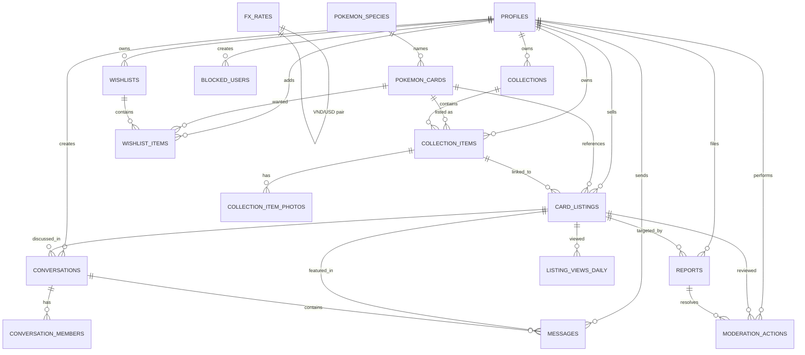

# CardSwap Database Schema

Complete schema documentation for the Postgres backend. Auto-generated types in `src/types/database.ts`.

## Entity Relationship Diagram



## Infrastructure Tables

### app_settings
Free-tier quotas and configuration. All limits are tunable without code changes (live effect on inserts).

```sql
CREATE TABLE public.app_settings (
  key TEXT PRIMARY KEY,
  value INT NOT NULL CHECK (value >= 0)
)
```

**Seeded defaults**:
- `max_active_users`: 100
- `msg_text_per_day`: 200
- `msg_image_per_day`: 5
- `max_collection_items`: 20
- `max_photos_per_item`: 3
- `message_retention_days`: 7

**Access**: SELECT public (read-only); insert/update/delete revoked from all roles (admin via SQL editor only).

**RLS Policies**:
- SELECT: Public (anyone can read settings for client UI)
- INSERT/UPDATE/DELETE: None (admin-only via direct SQL)

---

## Core Tables

### profiles
User accounts with profile metadata. Every signup creates a profile row via Supabase Auth trigger.

```sql
CREATE TABLE public.profiles (
  id UUID PRIMARY KEY REFERENCES auth.users(id) ON DELETE CASCADE,
  username TEXT NOT NULL UNIQUE CHECK (char_length(trim(username)) BETWEEN 3 AND 30),
  display_name TEXT CHECK (char_length(display_name) <= 60),
  bio TEXT CHECK (char_length(bio) <= 300),
  location_city TEXT,  -- City name from VN cities list
  avatar_url TEXT,     -- Public URL in storage.avatars bucket
  preferred_locale TEXT NOT NULL DEFAULT 'vi',  -- 'vi' or 'en'
  preferred_currency currency_code NOT NULL DEFAULT 'VND',  -- 'VND' or 'USD'
  role user_role NOT NULL DEFAULT 'USER',  -- 'USER' or 'ADMIN'
  status account_status NOT NULL DEFAULT 'ACTIVE',  -- 'ACTIVE', 'WAITLISTED', or 'SUSPENDED'
  terms_accepted_at TIMESTAMPTZ,  -- Onboarding completion flag
  created_at TIMESTAMPTZ NOT NULL DEFAULT now(),
  updated_at TIMESTAMPTZ NOT NULL DEFAULT now()
)
```

**Enums**:
- `user_role`: USER, ADMIN
- `account_status`: ACTIVE, WAITLISTED, SUSPENDED
- `currency_code`: VND, USD

**Free-tier enforcement**: the cap counts onboarded ACTIVE users (`active_member_count()`), so abandoned sign-ins never take a slot. When a collector accepts the terms, trigger `profiles_claim_slot` keeps them ACTIVE if a slot is free, else sets WAITLISTED. When a slot opens (user deleted or suspended, or `max_active_users` raised), `promote_waitlist()` promotes the longest-waiting WAITLISTED users (FIFO). Storage uploads are capped per user by `storage_upload_allowed(bucket)` in the storage insert policies (card photos: items × photos × 2 objects; avatars: 10/24h; chat images: daily image quota).

**Triggers**:
- `on_auth_user_created`: Inserts profile row when Supabase Auth creates user

**Indexes**:
- UNIQUE (username)

**RLS Policies**:
- SELECT: Own row + public profiles (username, display_name, avatar_url, bio, location_city, created_at)
- UPDATE: Own row only
- DELETE: Own row triggers account deletion cascade

### pokemon_cards
TCG catalog imported from TCGdex (EN + JA). Single row per card (language, set, number).

```sql
CREATE TABLE public.pokemon_cards (
  id UUID PRIMARY KEY DEFAULT gen_random_uuid(),
  external_source TEXT NOT NULL DEFAULT 'tcgdex',  -- Source: tcgdex
  external_id TEXT NOT NULL,  -- TCGdex card ID
  language TEXT NOT NULL,  -- 'en' or 'ja'
  name TEXT NOT NULL,  -- Card name (EN or JA)
  pokemon_name TEXT,  -- Species name (EN only, filled from dexId lookup)
  card_number TEXT NOT NULL,  -- e.g., '001/198'
  set_code TEXT NOT NULL,  -- TCGdex set code
  set_name TEXT NOT NULL,  -- Set name (EN or JA)
  hp INT,  -- Hit points (Pokémon cards only)
  type TEXT,  -- Card type (e.g., 'Fire', 'Grass', 'Colorless')
  rarity TEXT,  -- Rarity string (e.g., 'Ultra Rare', 'Uncommon')
  dex_ids INT[] NOT NULL DEFAULT '{}',  -- Pokédex IDs for species lookup
  printing TEXT[] NOT NULL DEFAULT '{}',  -- Variants (normal, holo, reverse, firstEdition)
  printed_total INT,  -- Total cards in set
  image_small_url TEXT,  -- TCGdex thumbnail URL
  image_large_url TEXT,  -- TCGdex full image URL
  release_date TEXT,  -- YYYY-MM-DD
  updated_at TIMESTAMPTZ NOT NULL DEFAULT now()
)
```

**Indexes**:
- UNIQUE (external_id, external_source, language)
- GIN on name, pokemon_name, set_code for full-text search + trigram
- (set_code, language)

**RLS Policies**:
- SELECT: Public (anyone can search catalog)
- INSERT/UPDATE/DELETE: None (app manages via migration scripts)

### collections
User's binders. Organizes owned cards. Default collection created per user on signup.

```sql
CREATE TABLE public.collections (
  id UUID PRIMARY KEY DEFAULT gen_random_uuid(),
  owner_id UUID NOT NULL REFERENCES profiles(id) ON DELETE CASCADE,
  name TEXT NOT NULL CHECK (char_length(trim(name)) BETWEEN 1 AND 60),
  description TEXT CHECK (char_length(description) <= 300),
  is_public BOOLEAN NOT NULL DEFAULT true,  -- Visible in public profile
  is_default BOOLEAN NOT NULL DEFAULT false,  -- One per user
  position INT NOT NULL DEFAULT 0,  -- Sort order
  created_at TIMESTAMPTZ NOT NULL DEFAULT now()
)
```

**Triggers**:
- `collections_protect_default`: Prevents deletion of default collection

**Indexes**:
- UNIQUE (owner_id) WHERE is_default
- (owner_id, position)

**RLS Policies**:
- SELECT: Own collections + public collections of non-blocked users
- INSERT/UPDATE: Own collections only
- DELETE: Own collections (except default)

### collection_items
Owned copies of cards. Single source of truth for "what I own"; listings reference items.

```sql
CREATE TABLE public.collection_items (
  id UUID PRIMARY KEY DEFAULT gen_random_uuid(),
  owner_id UUID NOT NULL REFERENCES profiles(id) ON DELETE CASCADE,
  collection_id UUID NOT NULL REFERENCES collections(id) ON DELETE CASCADE,
  card_id UUID NOT NULL REFERENCES pokemon_cards(id) ON DELETE RESTRICT,
  condition card_condition NOT NULL DEFAULT 'NEAR_MINT',
  printing TEXT NOT NULL DEFAULT 'normal',  -- normal, holo, reverse, firstEdition
  grading_company TEXT CHECK (grading_company IN ('PSA', 'BGS', 'CGC', 'ACE', 'OTHER')),
  grade NUMERIC(3,1) CHECK (grade BETWEEN 1 AND 10),
  quantity INT NOT NULL DEFAULT 1 CHECK (quantity BETWEEN 1 AND 999),
  estimated_value NUMERIC(14,2) CHECK (estimated_value >= 0),  -- User-entered valuation
  value_currency currency_code NOT NULL DEFAULT 'VND',
  notes TEXT CHECK (char_length(notes) <= 500),
  position INT NOT NULL DEFAULT 0,  -- Sort within collection
  created_at TIMESTAMPTZ NOT NULL DEFAULT now(),
  updated_at TIMESTAMPTZ NOT NULL DEFAULT now(),
  CHECK ((grading_company IS NULL) = (grade IS NULL))
)
```

**Enum**:
- `card_condition`: MINT, NEAR_MINT, EXCELLENT, LIGHT_PLAYED, PLAYED, POOR

**Triggers**:
- `collection_items_owner_check`: Ensures owner also owns target collection
- `collection_items_touch`: Updates `updated_at` on write

**Indexes**:
- (collection_id, position)
- (owner_id)
- (card_id)

**RLS Policies**:
- SELECT: Own items + items in public collections of non-blocked users
- INSERT/UPDATE: Own items only
- DELETE: Own items only

### collection_item_photos
Photos of owned cards (anti-scam requirement: ≥1 real photo per listing).

```sql
CREATE TABLE public.collection_item_photos (
  id UUID PRIMARY KEY DEFAULT gen_random_uuid(),
  item_id UUID NOT NULL REFERENCES collection_items(id) ON DELETE CASCADE,
  owner_id UUID NOT NULL REFERENCES profiles(id) ON DELETE CASCADE,
  thumb_path TEXT NOT NULL,  -- Relative path in storage.card-images bucket
  medium_path TEXT NOT NULL,  -- Relative path in storage.card-images bucket
  position INT NOT NULL DEFAULT 0,
  created_at TIMESTAMPTZ NOT NULL DEFAULT now()
)
```

**Indexes**:
- (item_id, position)

**RLS Policies**:
- SELECT: Own photos + photos in public collections of non-blocked users
- INSERT: Own photos only
- UPDATE/DELETE: Own photos only

### card_listings
Listings (owned copy + listing metadata). Seller references a collection_item.

```sql
CREATE TABLE public.card_listings (
  id UUID PRIMARY KEY DEFAULT gen_random_uuid(),
  seller_id UUID NOT NULL REFERENCES profiles(id) ON DELETE CASCADE,
  item_id UUID NOT NULL REFERENCES collection_items(id) ON DELETE CASCADE,
  card_id UUID NOT NULL REFERENCES pokemon_cards(id) ON DELETE RESTRICT,
  listing_type listing_type NOT NULL,  -- SALE, TRADE, SALE_OR_TRADE
  price NUMERIC(14,2),  -- NULL for TRADE-only listings
  currency currency_code NOT NULL DEFAULT 'VND',
  description TEXT CHECK (char_length(description) <= 1000),
  looking_for TEXT[] NOT NULL DEFAULT '{}',  -- Array of card names for TRADE
  is_active BOOLEAN NOT NULL DEFAULT true,
  moderation_status moderation_status NOT NULL DEFAULT 'VISIBLE',
  view_count INT NOT NULL DEFAULT 0,
  conversation_count INT NOT NULL DEFAULT 0,
  created_at TIMESTAMPTZ NOT NULL DEFAULT now(),
  updated_at TIMESTAMPTZ NOT NULL DEFAULT now()
)
```

**Enums**:
- `listing_type`: SALE, TRADE, SALE_OR_TRADE
- `moderation_status`: VISIBLE, HIDDEN_PENDING_REVIEW, REMOVED

**Indexes**:
- (is_active, created_at) -- Marketplace sort
- (card_id)
- (seller_id)
- (moderation_status)

**RLS Policies**:
- SELECT: VISIBLE listings + own listings
- INSERT/UPDATE: Own listings only
- DELETE: Own listings only

### wishlists
Wishlist organization. Default wishlist created per user.

```sql
CREATE TABLE public.wishlists (
  id UUID PRIMARY KEY DEFAULT gen_random_uuid(),
  owner_id UUID NOT NULL REFERENCES profiles(id) ON DELETE CASCADE,
  name TEXT NOT NULL,
  is_public BOOLEAN NOT NULL DEFAULT true,
  is_default BOOLEAN NOT NULL DEFAULT false,  -- One per user
  created_at TIMESTAMPTZ NOT NULL DEFAULT now()
)
```

**Indexes**:
- UNIQUE (owner_id) WHERE is_default

**RLS Policies**:
- SELECT: Own wishlists + public wishlists of non-blocked users
- INSERT/UPDATE: Own wishlists only

### wishlist_items
Wanted cards with optional max price + condition constraints.

```sql
CREATE TABLE public.wishlist_items (
  id UUID PRIMARY KEY DEFAULT gen_random_uuid(),
  owner_id UUID NOT NULL REFERENCES profiles(id) ON DELETE CASCADE,
  wishlist_id UUID NOT NULL REFERENCES wishlists(id) ON DELETE CASCADE,
  card_id UUID NOT NULL REFERENCES pokemon_cards(id) ON DELETE CASCADE,
  quantity INT NOT NULL DEFAULT 1,
  priority wishlist_priority NOT NULL DEFAULT 'MEDIUM',  -- HIGH, MEDIUM, LOW
  min_condition card_condition,
  printing TEXT,
  max_price NUMERIC(14,2),
  max_price_currency currency_code NOT NULL DEFAULT 'VND',
  notes TEXT CHECK (char_length(notes) <= 500),
  created_at TIMESTAMPTZ NOT NULL DEFAULT now()
)
```

**Enum**:
- `wishlist_priority`: HIGH, MEDIUM, LOW

**RLS Policies**:
- SELECT: Own items + items in public wishlists of non-blocked users
- INSERT/UPDATE: Own items only
- DELETE: Own items only

## Messaging Tables

### conversations
1:1 conversations between collectors, optionally linked to a listing.

```sql
CREATE TABLE public.conversations (
  id UUID PRIMARY KEY DEFAULT gen_random_uuid(),
  created_by UUID REFERENCES profiles(id) ON DELETE SET NULL,
  listing_id UUID REFERENCES card_listings(id) ON DELETE SET NULL,
  created_at TIMESTAMPTZ NOT NULL DEFAULT now(),
  last_message_at TIMESTAMPTZ NOT NULL DEFAULT now()
)
```

**Indexes**:
- (listing_id)

**RLS Policies**:
- SELECT: Member of conversation only
- INSERT: Via `start_conversation()` RPC only (enforces blocks, suspension)
- UPDATE/DELETE: None (app controls via RPC)

### conversation_members
Tracks conversation membership and read state.

```sql
CREATE TABLE public.conversation_members (
  conversation_id UUID NOT NULL REFERENCES conversations(id) ON DELETE CASCADE,
  user_id UUID NOT NULL REFERENCES profiles(id) ON DELETE CASCADE,
  joined_at TIMESTAMPTZ NOT NULL DEFAULT now(),
  last_read_at TIMESTAMPTZ NOT NULL DEFAULT now(),
  PRIMARY KEY (conversation_id, user_id)
)
```

**Triggers**:
- `conversation_members_block_check`: Prevents adding blocked users

**Indexes**:
- (user_id)

**RLS Policies**:
- SELECT: Own memberships only
- INSERT/UPDATE/DELETE: Via `start_conversation()` RPC only

### messages
Chat messages in a conversation. Realtime via postgres_changes subscription.

```sql
CREATE TABLE public.messages (
  id BIGSERIAL PRIMARY KEY,
  conversation_id UUID NOT NULL REFERENCES conversations(id) ON DELETE CASCADE,
  sender_id UUID REFERENCES profiles(id) ON DELETE SET NULL,
  kind message_kind NOT NULL DEFAULT 'TEXT',  -- TEXT, LISTING, IMAGE
  body TEXT CHECK (char_length(body) <= 2000),
  listing_id UUID REFERENCES card_listings(id) ON DELETE SET NULL,
  image_path TEXT,  -- Relative path in storage.chat-images bucket (signed URL on read)
  created_at TIMESTAMPTZ NOT NULL DEFAULT now()
)
```

**Enum**:
- `message_kind`: TEXT, LISTING, IMAGE

**Triggers**:
- `messages_before_insert`: Validates sender is member + not blocked/suspended, updates `conversations.last_message_at`
- `messages_rate_limit`: Caps 30 messages/min per sender

**Indexes**:
- (conversation_id, created_at)

**RLS Policies**:
- SELECT: Member of conversation only
- INSERT: Member of conversation, not blocked/suspended (via trigger check)
- UPDATE/DELETE: None (immutable messages)

## Safety & Moderation Tables

### blocked_users
Bidirectional user blocking (either direction blocks both).

```sql
CREATE TABLE public.blocked_users (
  blocker_id UUID NOT NULL REFERENCES profiles(id) ON DELETE CASCADE,
  blocked_id UUID NOT NULL REFERENCES profiles(id) ON DELETE CASCADE,
  created_at TIMESTAMPTZ NOT NULL DEFAULT now(),
  PRIMARY KEY (blocker_id, blocked_id),
  CHECK (blocker_id <> blocked_id)
)
```

**Indexes**:
- (blocked_id)

**RLS Policies**:
- SELECT: Own blocks only
- INSERT: Own blocks only
- DELETE: Own blocks only

### reports
User or listing reports (filed by community, resolved by admins).

```sql
CREATE TABLE public.reports (
  id UUID PRIMARY KEY DEFAULT gen_random_uuid(),
  reporter_id UUID REFERENCES profiles(id) ON DELETE SET NULL,
  target_user_id UUID REFERENCES profiles(id) ON DELETE CASCADE,
  target_listing_id UUID REFERENCES card_listings(id) ON DELETE CASCADE,
  reason report_reason NOT NULL,
  details TEXT CHECK (char_length(details) <= 1000),
  status report_status NOT NULL DEFAULT 'OPEN',  -- OPEN, RESOLVED, DISMISSED
  resolved_by UUID REFERENCES profiles(id) ON DELETE SET NULL,
  resolution_note TEXT CHECK (char_length(resolution_note) <= 1000),
  created_at TIMESTAMPTZ NOT NULL DEFAULT now(),
  resolved_at TIMESTAMPTZ,
  CHECK (target_user_id IS NOT NULL OR target_listing_id IS NOT NULL)
)
```

**Enums**:
- `report_reason`: SCAM_SUSPICION, HARASSMENT, SPAM, FAKE_LISTING, MISLEADING_CONDITION, PROHIBITED_CONTENT, FAKE_CARD, WRONG_PRICE, WRONG_CARD_INFO, MISLEADING_PHOTOS, OTHER
- `report_status`: OPEN, RESOLVED, DISMISSED

**Triggers**:
- `reports_before_insert`: Enforces rate limit (20/day), populates target_user_id if target_listing_id set
- `reports_auto_hide`: Auto-hides listing when 3+ distinct reporters flag it

**Indexes**:
- UNIQUE (reporter_id, target_listing_id) WHERE status = 'OPEN'
- UNIQUE (reporter_id, target_user_id) WHERE status = 'OPEN'
- (created_at DESC) WHERE status = 'OPEN'

**RLS Policies**:
- SELECT: Own reports + admin reads all
- INSERT: Active user only (via trigger check)

### moderation_actions
Audit log of all admin actions (resolve report, hide listing, suspend user).

```sql
CREATE TABLE public.moderation_actions (
  id UUID PRIMARY KEY DEFAULT gen_random_uuid(),
  admin_id UUID REFERENCES profiles(id) ON DELETE SET NULL,
  action TEXT NOT NULL,  -- 'resolve_report', 'hide_listing', 'suspend_user', etc.
  report_id UUID REFERENCES reports(id) ON DELETE SET NULL,
  target_user_id UUID REFERENCES profiles(id) ON DELETE SET NULL,
  target_listing_id UUID REFERENCES card_listings(id) ON DELETE SET NULL,
  note TEXT CHECK (char_length(note) <= 1000),
  created_at TIMESTAMPTZ NOT NULL DEFAULT now()
)
```

**RLS Policies**:
- SELECT: Admin only
- INSERT/UPDATE/DELETE: Via RPC only (security-definer)

## Infrastructure Tables

### fx_rates
Foreign exchange rates (VND ↔ USD) updated daily.

```sql
CREATE TABLE public.fx_rates (
  base currency_code NOT NULL,  -- VND or USD
  quote currency_code NOT NULL,  -- USD or VND
  rate NUMERIC(10,6) NOT NULL,
  fetched_at TIMESTAMPTZ NOT NULL DEFAULT now(),
  PRIMARY KEY (base, quote)
)
```

**RLS Policies**:
- SELECT: Public (anyone can read rates)
- INSERT/UPDATE: Via Edge Function only

### listing_views_daily
Deduped view counts per listing per viewer/day (for popularity metrics).

```sql
CREATE TABLE public.listing_views_daily (
  listing_id UUID NOT NULL REFERENCES card_listings(id) ON DELETE CASCADE,
  viewer_key TEXT NOT NULL,  -- signed-in user id (anonymous views are not counted)
  day TEXT NOT NULL,  -- YYYY-MM-DD
  PRIMARY KEY (listing_id, viewer_key, day)
)
```

**Triggers**:
- `record_listing_view` RPC inserts or ignores (idempotent)

### pokemon_species
Pokédex lookup for mapping Japanese cards to English Pokémon names.

```sql
CREATE TABLE public.pokemon_species (
  dex_id INT PRIMARY KEY,
  name_en TEXT NOT NULL  -- English species name
)
```

## Key Constraints & Triggers

| Trigger | Table | Event | Logic |
|---------|-------|-------|-------|
| `on_auth_user_created` | profiles | AFTER INSERT (auth.users) | Create profile row + default collection + default wishlist |
| `collection_items_owner_check` | collection_items | BEFORE INSERT/UPDATE | Verify owner also owns collection |
| `collection_items_touch` | collection_items | BEFORE UPDATE | Update `updated_at` |
| `collections_protect_default` | collections | BEFORE DELETE | Prevent deletion of is_default=true |
| `reports_before_insert` | reports | BEFORE INSERT | Rate limit check (20/day), populate target_user_id |
| `reports_auto_hide` | reports | AFTER INSERT | Auto-hide listing if 3+ distinct reporters |
| `messages_before_insert` | messages | BEFORE INSERT | Member check, block check, update conv last_message_at |
| `messages_rate_limit` | messages | BEFORE INSERT | Cap 30 messages/min |
| `conversation_members_block_check` | conversation_members | BEFORE INSERT | Reject if members are blocked |

## Key RPC Functions

| RPC | Returns | Security | Logic |
|-----|---------|----------|-------|
| `start_conversation(other_uuid, listing_uuid?)` | uuid | DEFINER | Checks blocks, suspension, rate limit; creates or reuses conv + members |
| `search_listings(filters)` | table | INVOKER | Joins card+owner+fx; applies RLS (blocks); returns search results |
| `search_catalog(query, language?, limit?)` | table | INVOKER | Full-text search on pokemon_cards (trigram + tsvector) |
| `inbox(limit?)` | table | INVOKER | Single round-trip: all conversations, last message, unread count, is_blocked |
| `collection_stats(currency?)` | table | INVOKER | Aggregates user's collection: total_cards, estimated_value, sets, etc. |
| `marketplace_facets()` | json | INVOKER | Returns available sets, rarities, languages, printings for sidebar |
| `is_admin()` | bool | DEFINER | Checks if current user is admin |
| `is_active_user()` | bool | DEFINER | Checks if current user is ACTIVE (not WAITLISTED/SUSPENDED) |
| `is_onboarded_user()` | bool | DEFINER | Checks if current user is ACTIVE or WAITLISTED (for wishlist access) |
| `is_blocked_between(a, b)` | bool | DEFINER, internal only | Bidirectional block check used inside other definer functions |
| `is_blocked_with(other)` | bool | DEFINER | Caller-scoped block check for clients and invoker RPCs |
| `waitlist_position()` | int | DEFINER | 1-based position in line for waitlisted user; NULL if not waitlisted |
| `promote_waitlist()` | void | DEFINER | Auto-promote longest-waiting WAITLISTED users to ACTIVE (internal trigger call) |
| `admin_list_waitlist()` | table | DEFINER | Admin-only: returns waitlist (500 max) in FIFO order |
| `app_setting(key)` | int | DEFINER | Fetch a quota limit value (called by triggers) |
| `purge_expired_chat()` | table | DEFINER | Delete messages older than `message_retention_days`; return orphaned chat-image paths |
| `admin_resolve_report(report, status, note?)` | void | DEFINER | Admin-only: update report status + log action |
| `admin_set_listing_moderation(listing, status, note?)` | void | DEFINER | Admin-only: update listing status + log action |
| `admin_set_user_status(user, status, note?)` | void | DEFINER | Admin-only: update user status + log action |

---

**Last updated**: 2026-10-02 · **Version**: v1 (launch)
